2&emsp;Getting Ubuntu
---

# 2.1&emsp;Single Boot and Dual Boot
| | |
| -- | -- |
| Summary | Download Ubuntu `.iso` disk image, flash the image into a USB stick, and boot into the Ubuntu installer via the stick. | 
| Who? | These instructions are for dual boot and single boot. Skip this section if VirtualBox will be used. |
| Reference | The instructions are based on https://ubuntu.com/tutorials/install-ubuntu-desktop. |

---

1. Download the Ubuntu 24.04  `.iso` disk image (5.9GB) from https://ubuntu.com/download/desktop.
    
    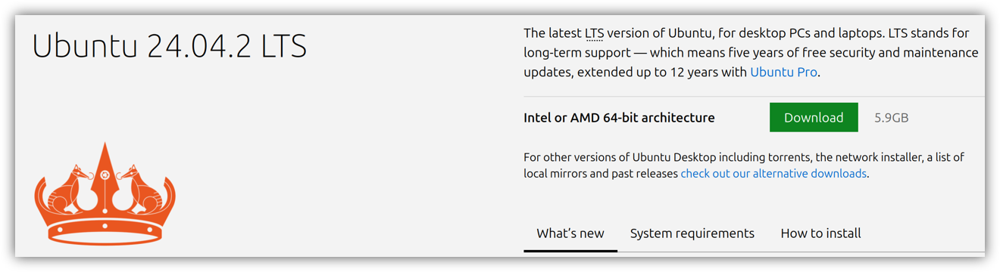

2. Find a USB stick that is at least 8GB. **ATTENTION!** The USB stick's contents will be erased entirely.

3. Download Balena Etcher from https://etcher.balena.io/#download-etcher, to flash the `.iso` image into the stick.
    
    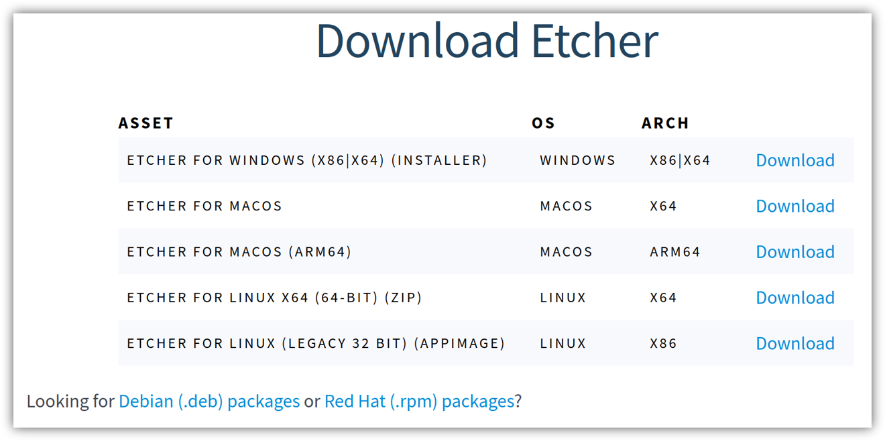

4. Use Balena Etcher to flash the downloaded Ubuntu 24.04 `.iso` image.
    1. Click `Flash from file` and select the `.iso` image.
    2. Plugin the USB stick into the computer, and click `Select target` and ensure that your USB stick is selected.
    3. Click `Flash!`.
    4. Wait for a few minutes for the flashing to complete.
    5. Eject your USB stick when done.

5. Shutdown only the PC where Ubuntu will be installed.

6. While the PC is turned off, plug in the newly flashed USB stick.

7. Before switching on the PC, please find out the key to press to load into the **one-time boot menu** for the PC's brand. For Dell, it is `F12`, and can only be pressed when the Dell logo shows during booting. 

8. Turn on the PC and enter the boot menu. Select the option that is your USB stick. If the wrong choice is selected, simply restart the computer and re-enter the boot menu.

9. Proceed to [3.1 Installing Steps](03_Installing_Ubuntu.md#31installation-steps)

# 2.2&emsp;VirtualBox
| | |
| -- | -- |
| Summary | Download Ubuntu `.iso` disk image, install VirtualBox, and create a new virtual machine on VirtualBox with the `.iso` disk image. | 
| Who? | These instructions are for VirtualBox users only. Skip this section if you are dual booting or single booting. |

---

1. Download the Ubuntu 24.04  `.iso` disk image (5.9GB) from https://ubuntu.com/download/desktop.
    
    

2. Download and install VirtualBox from https://www.virtualbox.org/wiki/Downloads.

    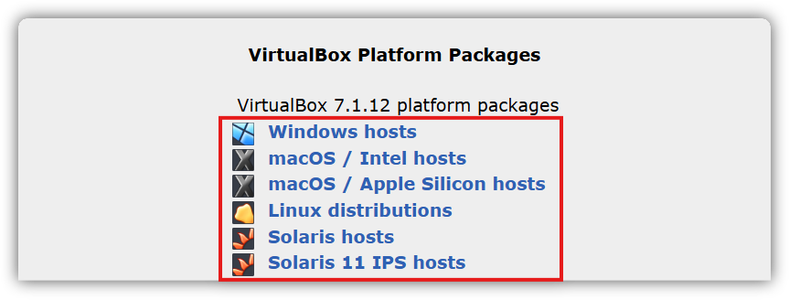

3. Open the installer, click `Next`.

    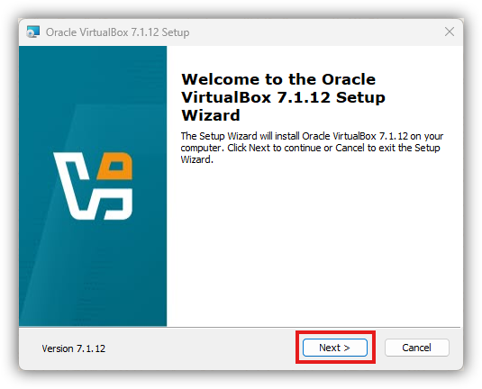

4. Accept the license agreement and click `Next`.

    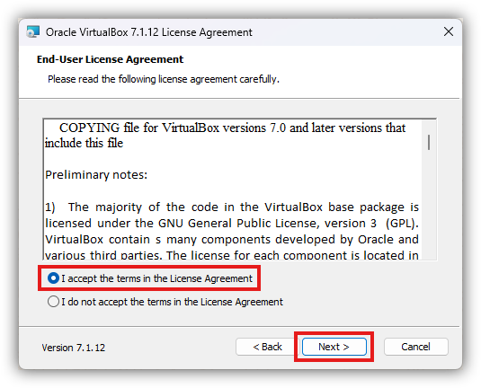

5. Click `VirtualBox Python Support` and click `Entire feature will be unavailable`. This is only used for running VirtualBox from a script and nothing to do with any Python installations in the virtual machine. Click `Next`.

    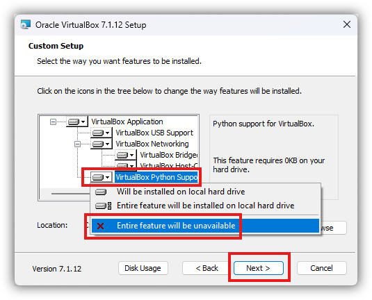

6. Internet may be disabled temporarily durin ginstallation. Click `Yes`.

    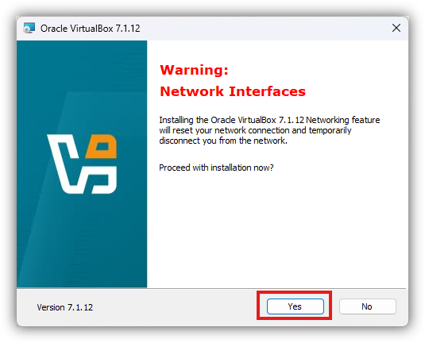

7. Select the options and click `Next`.

    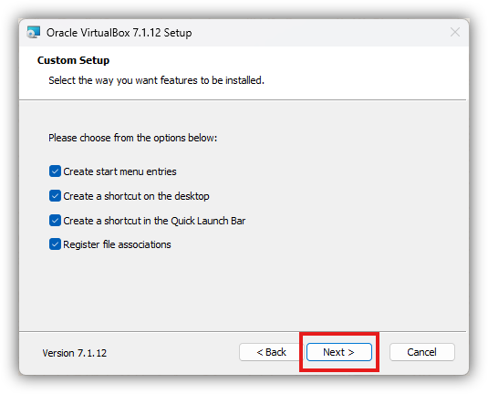

8. Click `Install`.

    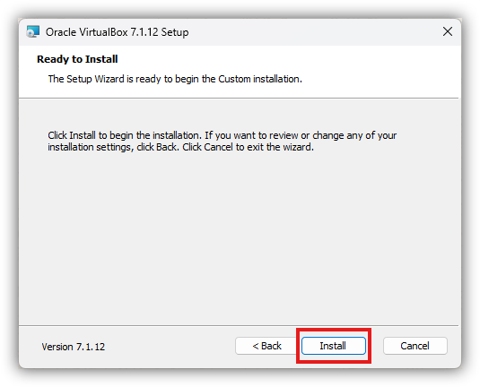

9. Click `Finish` and select the option to start VirtualBox after the installation.

    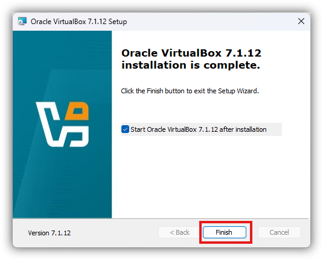

10. Once VirtualBox has started, click the `New` button.

    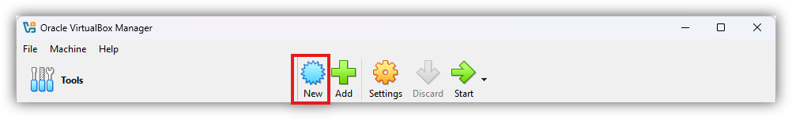

11. Under `Name and Operating System`,
    1. For `Name`, type `Ubuntu 24.04` or something else.
    
    2. For `ISO Image`, select the `.iso` disk image that was downloaded in the first step of this section.

    3. Check `Skip Unattended Installation`.

    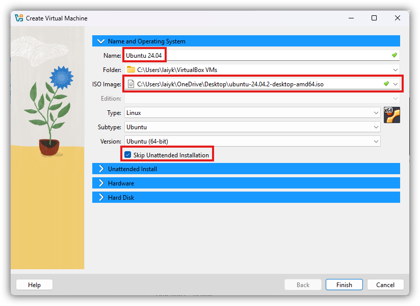

12. Under `Hardware`

    1. Slide the `Base Memory` slider to the maximum allowed by the green bar. Make sure the `Invalid settings detected` warning is not shown at the bottom of the window.

    2. Slide the `Processors` slider to the maximum allowed by the green bar. Make sure the `Invalid settings detected` warning is not shown at the bottom of the window.

    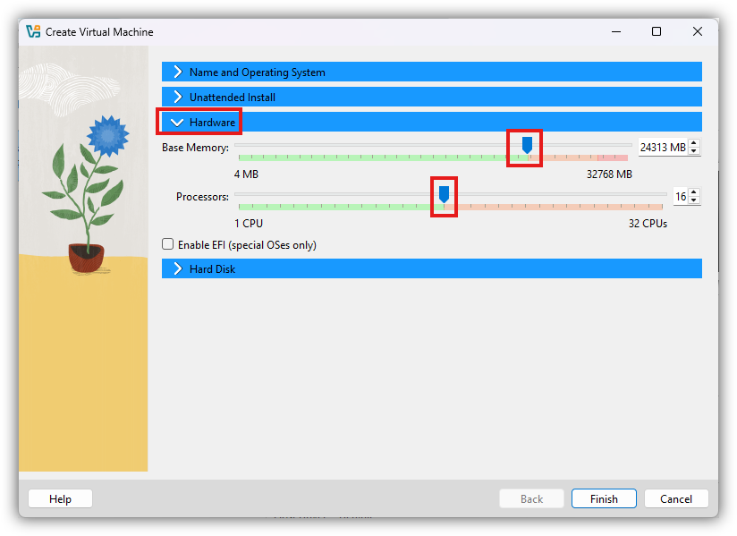

13. Under `Hard Disk`,

    1. In the box for hard disk size, type at least `20GB` or about `40 GB` (recommended). If you are going to use this software in the long term, select around `100 GB` to be safe. 

    2. Make sure **not** to pre-allocate full size. The virtual hard disk is a file that stores the entire virtual Ubuntu. The maximum file size is determined by the value you have chosen above. The initial file size would be much smaller than the value you have chosen, and will increase in size as more files are stored in the virtual Ubuntu. If pre-allocated, the full size will be used from the start, and the host operating system (Windows) may run out of space.

    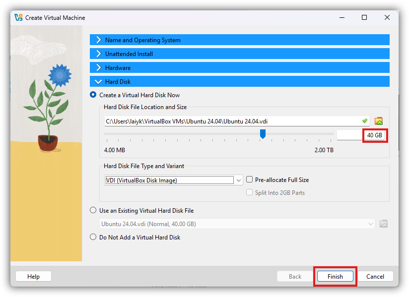

14. Click `Finish`.

15. The newly created virtual machine should now be visible on the left. Select it, and click `Settings`. 

    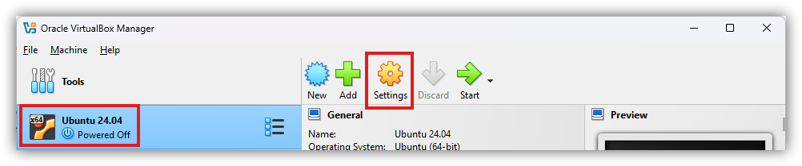

16. Under the `General` tab, 
    
    1. Click the `Advanced` tab.

    2. For `Shared Clipboard`, select `Bidirectional`.

    3. For `Drag'n'Drop`, select `Bidirectional`.

    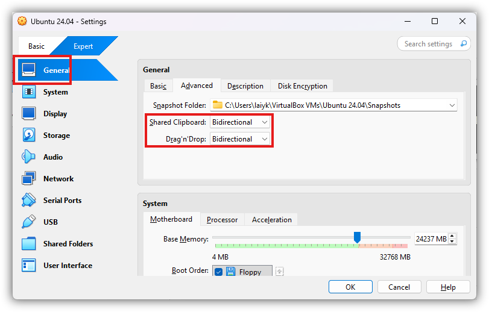

17. Under the `Display` tab,

    1. Click the `Screen` tab.

    2. Select `Enable 3D Acceleration`.

    3. Slide the bar to the maximum allowed for `Video Memory`.

    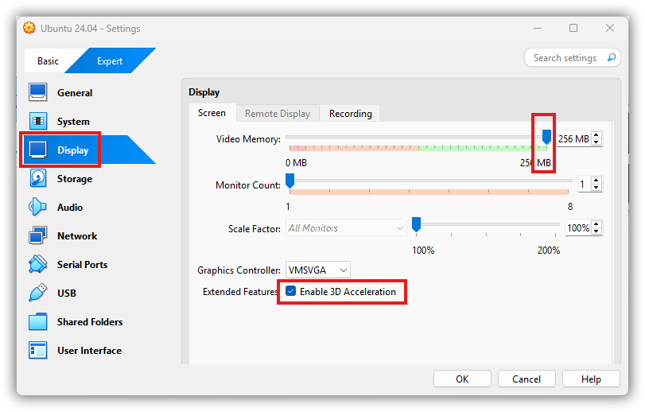

18. Under the `Network` tab,

    1. Click the `Network Adapter 1` tab.

    2. Make sure that `Enable Network Adapter` is checked.

    3. Make sure that `Attached to` is `NAT`. 
    
    4. Please keep in mind the following. If connecting to the school network, only `NAT` is possible. However, to communicate with a physical robot, `Bridged Adapter` has to be selected, which disables access to the school network. It is not possible to use another software adapter (e.g. `Adapter 2`) to connect to both the school network and robot at the same time.

    5. Click `OK` to close the window.

    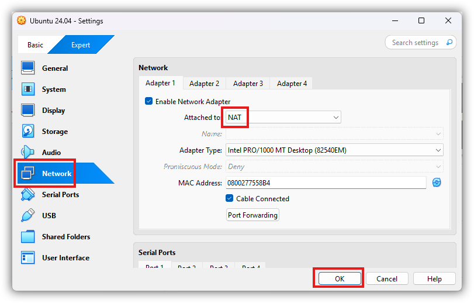

19. Once at the VirtualBox window, select the configured virtual machine and click `Start`.

    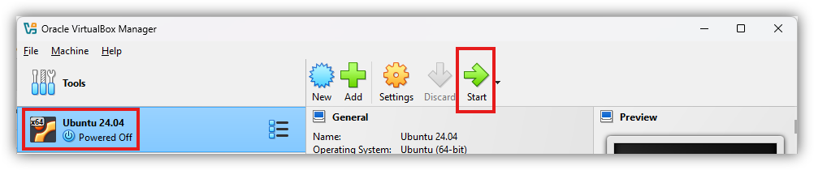

20. Proceed to [3.1 Installing Steps](03_Installing_Ubuntu.md#31installation-steps).
