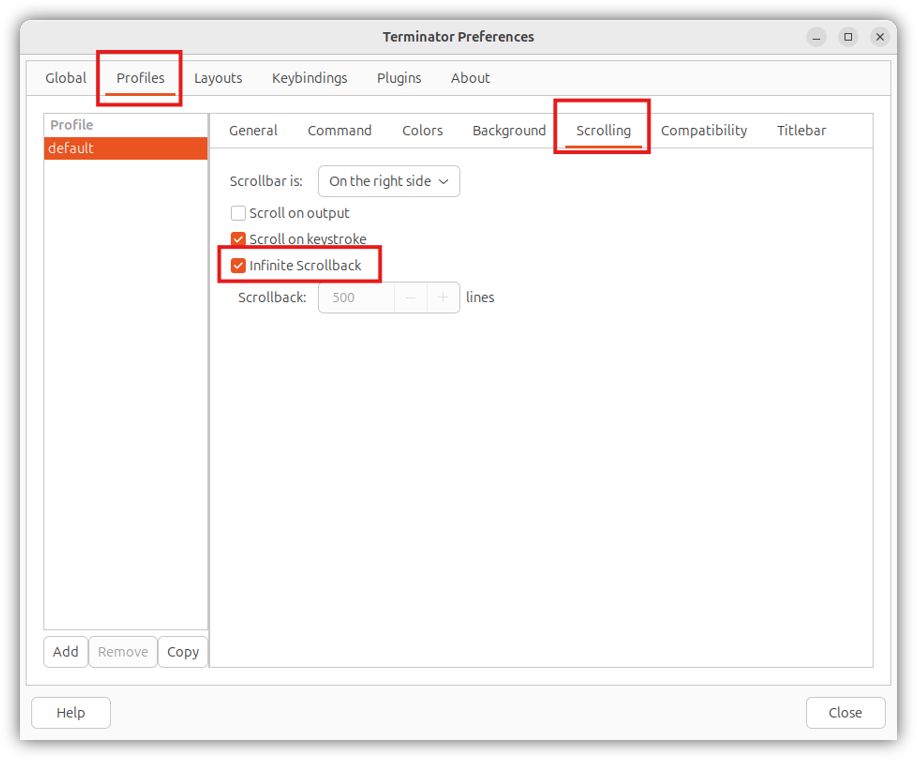
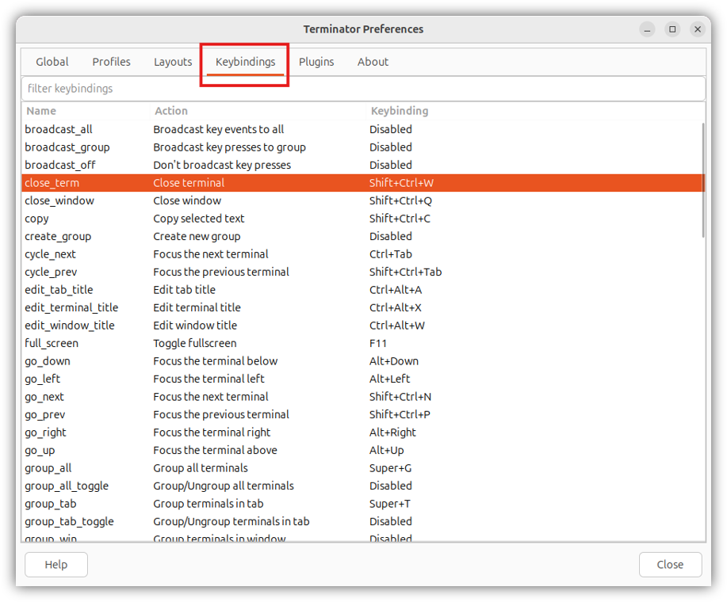
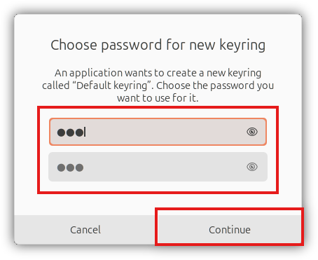
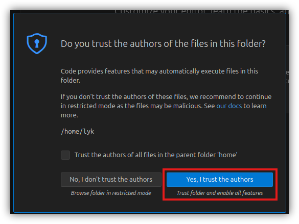
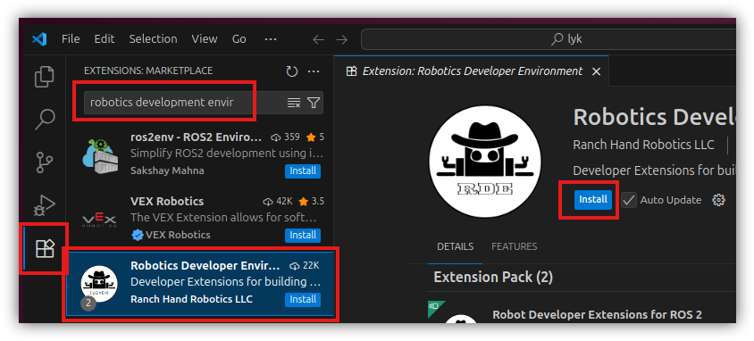
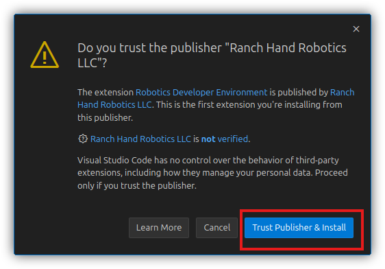

4&emsp;Install Ubuntu Software
==============
Install Software in Ubuntu 24.04.

# Table of Contents

[4.1&emsp;Terminator](#41terminator)

[4.2&emsp;Install VSCode](#42install-vscode)

[4.3&emsp;Install ROS2 Jazzy](#43install-ros2-jazzy)

# 4.1&emsp;Terminator

| | |
| -- | -- |
| Summary | Install Terminator, which is an enhanced terminal that arranges multiple terminals together, and is useful for robotic applications when multiple terminals are typically launched.  | 
| Who? | These instructions are for all users. |


1. Pull up a terminal with `Ctrl+Alt+T`.
2. Run the following:
    ```bash
    sudo apt update
    sudo apt install terminator -y
    ```
    Ensure that one-line commands are not split into multiple lines. A password for `sudo` may be required.

3. Once installed, close the current terminal.

4. Launch the new terminal with `Ctrl+Alt+T`. A red bar can be seen at the top of the terminal.

5. Set infinite scrollback so we can see more terminal output for robotics programs. The default number of output lines kept by the terminal is usually not sufficient.
    1. On the terminal (black background), right-click and select `Preferences`.
    2. On the newly opened window, click `Profiles`, 
    3. Click `Scrolling`.
    4. Check `Infinite Scrollback`.

    


6. Examine the full list of shortcut keys that could be useful for you. Click the `Keybindings` tab. The following shortcuts maybe useful:
    1. `Ctrl+Shift+W`: Close a terminal.
    2. `Ctrl+Shift+O`: Open a new terminal below the current.
    3. `Ctrl+Shift+E`: Open a new terminal to the right of the current.
    4. `Ctrl+Tab`: Go to next terminal.
    5. `Ctrl+Shift+Tab`: Go to previous terminal.
    6. `Ctrl+Shift+C`: Copy text.
    7. `Ctrl+Shift+V`: Paste text.

    

7. Proceed to the next section.

# 4.2&emsp;Install VSCode

| | |
| -- | -- |
| Summary | Visual Studio Code is an integrated development environment for developing code. It is primarily useful for its Intellisense / Copilot features and debugging features. | 


1. Using a terminal (or a new one with `Ctrl+Alt+T`), run:
    ```bash
    sudo snap install --classic code
    ```
2. After installation completes, run VSCode at the current directory with:
    ```bash
    code .
    ```
3. You may be prompted for a password for a new keyring. You may use your original password. Click `Continue` after you are done.

    

4. After opening VSCode, a permissions dialog will appear. We are only opening VSCode to install extensions. You click `Yes, I trust the authors` to continue.

    

5. Install the *Robotics Development Environment* extension, which supersedes Microsoft's *ROS* extension. 
    1. Click on the `Extensions` tab on the left (Ctrl+Shift+X), 
    2. Search for `robotics development environment`
    3. Click on the extension by `Ranch Hand Robotics LLC`.
    4. Click `Install`.

        

    5. Click `Trust Publisher & Install`

        

    6. Wait for a few seconds to finish the install. You may now close the window.

6. If you are developing C++ code for ROS2 in EE4308 or other courses, it will be a good idea to install the `C/C++ Extension Pack` by Microsoft.

7. Proceed to the next section.

# 4.3&emsp;Install ROS2 Jazzy

| | |
| -- | -- |
| Summary | The Robot Operating System 2 (ROS2) is a suite of software for standardizing robotics development. ROS2 Jazzy (Version J) is being actively maintained till 2029, and its main supported system is Ubuntu 24.04. To avoid problems, avoid installing ROS2 Jazzy on other Ubuntu versions, or other versions of ROS2 on Ubuntu 24.04. | 
| It is big | About 1.1 GB of files may be downloaded, and installation may take between 10 to 30 minutes. |
| Reference | Instructions are modified from https://docs.ros.org/en/jazzy/Installation/Ubuntu-Install-Debs.html. The tier 1 support between ROS versions and Ubuntu versions can be found at https://www.ros.org/reps/rep-2000.html. |

1. Open a terminal. Run the following commands, key in your password and press `Enter` when prompted:
    ```bash
    sudo apt install software-properties-common -y

    sudo add-apt-repository universe
    ```
2. Continue running the commands. The brown text at the bottom indicates download progress. The green bar indicates installation progress after downloading. Both bar for `sudo apt upgrade -y`, and again for `sudo apt install ...`. This process will transfer about 1.1 GB of data and take between 10 to 30 minutes.
    ```bash

    sudo apt update

    sudo apt install curl -y

    export ROS_APT_SOURCE_VERSION=$(curl -s https://api.github.com/repos/ros-infrastructure/ros-apt-source/releases/latest | grep -F "tag_name" | awk -F\" '{print $4}')

    curl -L -o /tmp/ros2-apt-source.deb "https://github.com/ros-infrastructure/ros-apt-source/releases/download/${ROS_APT_SOURCE_VERSION}/ros2-apt-source_${ROS_APT_SOURCE_VERSION}.$(. /etc/os-release && echo $VERSION_CODENAME)_all.deb"

    sudo dpkg -i /tmp/ros2-apt-source.deb

    sudo apt update 

    sudo apt upgrade -y

    sudo apt install ros-jazzy-desktop ros-dev-tools ros-jazzy-ros-gz -y
    # sudo apt install ros-jazzy-desktop ros-dev-tools ros-jazzy-ros-gz ros-jazzy-turtlebot3-gazebo ros-jazzy-turtlebot3-teleop ros-jazzy-turtlebot3-cartographer ros-jazzy-nav2-map-server ros-jazzy-turtlebot3-navigation2 ros-jazzy-nav2-route -y
    ```

    <!-- 
    echo 'source /opt/ros/jazzy/setup.bash' >> ~/.bashrc
    source ~/.bashrc
    -->

3.  We will inform all new terminals that ROS2 Jazzy and its command line interfaces can be found at its installation directory by modifying the `.bashrc` file. The `.bashrc` file is run everytime a new terminal opens.
    
    1. On the terminal, open the `.bashrc` file with:
        ```bash
        code ~/.bashrc
        ```

    2. Insert a ***new* line at the bottom of the file** (press `Ctrl+End`). This line tells a newly opened terminal that ROS2 exists and can be used: 
        ```bash
        source /opt/ros/jazzy/setup.bash
        ```

    3. Save (`Ctrl+S`) and close the file.

    4. Close all terminals and reopen new terminals, so the `.bashrc` file with the new ROS command is run. Alternatively, you may run `source ~/.bashrc` on all open terminals to run the `.bashrc` file.
    
3. Test the ROS installation.
    1. Open two new terminals.
    2. On one terminal, run:
        ```bash
        ros2 run demo_nodes_cpp talker
        ```
        Some output can now be seen on the terminal.
    3. On the other terminal, run:
        ```bash
        ros2 run demo_nodes_cpp listener
        ```
        If this `listener` is echoing what the `talker` is printing, then the installation is successful.
    4. You may now close all terminals.

4. Proceed to setup a private GitHub repository in [5 Private GitHub Repository](05_Private_GitHub_Repository.md).


