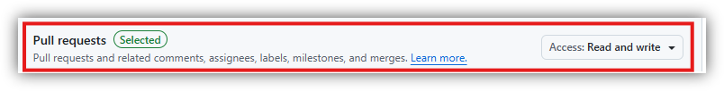
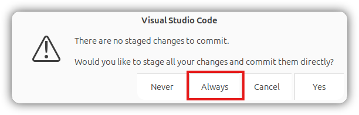

5&emsp;Private GitHub Repository
---

Here we create a GitHub repository that will be used by this course.

# 5.1&emsp;Create Account and Repository

| | |
| -- | -- |
| Summary | Create a GitHub account and the `rb2301` private GitHub repository. |

1. Sign up for a new GitHub account at https://github.com.

2. After signing up, go to https://github.com/new to create a new repository.

    1. Use `rb2301` as the repository name.

    2. Set the repository to `Private`. This is compulsory.

    3. Make sure a `README` file is added.

    

    The page may look different from the above.

3. Click `Create repository`.

4. At the repository, take note of the URL which should look like `https://github.com/<UserName>/rb2301`, where `<UserName>` is your GitHub username.

4. Proceed to the next section.

# 5.2&emsp;Create Personal Access Token

| | |
| -- | -- |
| Summary | Create a Personal Access Token (PAT) to read and write to the private repository from Ubuntu. |
| Reference | Instructions are modified from https://docs.github.com/en/authentication/keeping-your-account-and-data-secure/managing-your-personal-access-tokens. |


1. Go to https://github.com/settings/personal-access-tokens/new. You may need to verify your email or use 2FA to be able to access this page. 

    

2. Once accessed, click `Generate new token`.

    

3. Once on the page to generate the new token, set the the token name as `rb2301` or something else.

4. Set an expiration date, which can be at the end of the year which you take the course.

5. Select the repository access. Select the `rb2301` repository by selecting `Only select repositories`. 

6. Under `Permissions`, change the access settings for the following to `Read and write`:

    1. `Commit statuses`.

    2. `Contents`.

    3. `Pull requests`. This may be important for team project later.

    4. You may select others as you deem fit.

    
    

7. Click `Generate token` at the bottom of the page.
    
    

8. Review the token in a popup box, and click `Generate token` again.

    
    
9. In the new page, copy the long string of characters which is your token and save it somewhere that only you can see. The token will be deactivated if GitHub discovers it online. Lets call this `<PAT>` which will be used later.

10. Proceed to the next section.

# 5.3&emsp;Configure `git` on Ubuntu

| | |
| -- | -- |
| Summary | Configure `git` if not done so. |
| Who? | This section can be skipped if you have already done this once for your Ubuntu. |

1. Use an existing terminal or open a new one.

2. Make sure `git` is installed, which should already have been if ROS2 Jazzy is installed from [4.3 Install ROS2 Jazzy](04_Installing_Ubuntu_Software.md#43install-ros2-jazzy). Otherwise, install it with:

    ```bash
    sudo apt install git -y
    ```

3. Replace `<Name>` with your username (can have spaces) and `<Email>` with your email. Make sure both are in quotes:
    ```bash
    git config --global user.name "<Name>"

    git config --global user.email "<Email>"
    ```

4. Proceed to the next section.

# 5.4&emsp;Clone Repository 
| | |
| -- | -- |
| Summary | Clone the `rb2301` private repository to Ubuntu.  |

1. Use an existing terminal or open a new one.

2. The private repository URL should be `https://github.com/<UserName>/rb2301`, where `<UserName>` is your GitHub username. Run the command below by modifying the URL with `<PAT>@` where `<PAT>` is the personal access token you have created earlier:

    ```bash
    cd ~

    git clone https://<PAT>@github.com/<YourUserName>/rb2301
    ```

3. Proceed to the next section.

# 5.5&emsp;Open Repository 
| | |
| -- | -- |
| Summary | Open the newly cloned `rb2301` private repository with VSCode on Ubuntu, and set up VSCode for this new repository. |

1. Use an existing terminal or open a new one.

2. Open the repository with:

    ```bash
    cd ~/rb2301

    code .
    ```
3. Select `Yes, I trust the authors` if this shows up.
    
    

4. Proceed to the next section.

# 5.6&emsp;Pushing Commits
| | |
| -- | -- |
| Summary | "Saving" the repository to GitHub using VSCode. As an example, create the `.gitignore` file and modifying `README.md` file. Then, stage the changes in a commit and push the commit to GitHub. Steps to simplify the process on VSCode are shown. |

1. Modify the `README.md` file in the private `rb2301` repository. 

    1. On VSCode, select the `Explorer` tab, click `README.md`.

    2. Add some text to `README.md`.

    3. Press `Ctrl+S` to save.

    

2. Create a new `.gitignore` file. Files and folders listed in the `.gitignore` file are not uploaded to GitHub. This is particularly useful as only the small files containing source code should be uploaded, instead of the large executables that were built from the source code.

    1. On VSCode, select the `Explorer` tab, right-click on the empty space and click `New File...`.

        

    2. Type in `.gitignore` as the file name. Do not forget the prefix `.`.

    3. Add the following four lines into `.gitignore`:

        ```
        build/
        install/
        log/
        .vscode/
        ```
        This means the four folders `build`, `install`, `log`, and `.vscode` are not uploaded to GitHub even while it may be generated later during the course. Some of these folders can be quite large and may only work on the computer where it is built.

        

    4. Press `Ctrl+S` to save.

3. Now, push a commit to the main branch on GitHub (save any changes online). 

    1. Go to the `Source Control` tab, and type in a commit message. Make sure it is not blank, otherwise, a file may open after the next step where the commit message needs to be typed and then saved.

    2. Click `Commit`.

    

    3. If the user name and email were not set in [5.3 Configure Git on Ubuntu](#53configure-git-on-ubuntu), a prompt may appear. Repeat step 3 in that section on a terminal, and try to commit again.

    4. A prompt about no staged changes will appear if this is the first time using VSCode for source control (fresh use). Click `Always`, and the prompt will never appear again.

        

    5. Click `Sync Changes` (up arrow shown).

    6. A prompt about pulling and pushing to the branch `origin/main` will appear in a fresh use. Click `OK, Don't Show Again`. 
    
        

    Take note that if other branches are used in the future, be sure to select the correct branch to checkout.

    7. A prompt about periodically fetching at the bottom right corner of the screen will appear in a fresh use. Click `Yes`, and VSCode will periodically check GitHub for any updates if different computers or users are contributing to the project at different times.

        

    8. The next time a commit is pushed, only steps 1, 2 and 5 are required.

    9. The next section is for your information only.

# 5.7&emsp;Pulling Commits

When the repository is **updated somewhere else** (e.g. another computer, via GitHub website, or another contributor), the local copy on the current machine needs to be synchronized. Simply go to the `Source Control` tab, and click `Sync Changes` (down arrow shown). Make sure that VSCode periodically fetches from GitHub to avoid problems.


